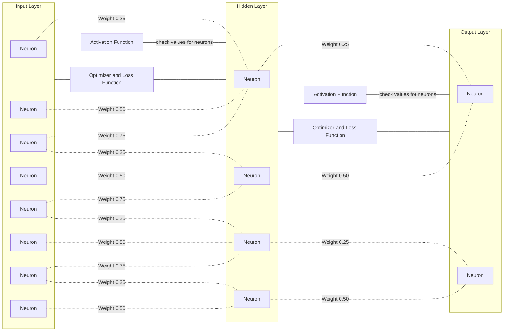

## What is a Neural Network?
A neural network is a computational system that learns to perform tasks by analyzing vast amounts of data. It is inspired by the biological neural networks that make up the human brain.

---

## Components of a Neural Network
**Static Components:**
> **Neurons**: Neurons are individual computational units within a neural network. Each neuron holds a numerical value that represents its activation level. These values are computed based on inputs and determine the neuron's output.

> **Layers of Neurons**: Neurons are organized into layers within a neural network. There are typically three types of layers:
>   - **Input Layer**: The first layer that receives raw input data. It acts as an interface to the external world and holds the initial data.
>   - **Hidden Layers**: Intermediate layers that process data and learn features. They act as interfaces between the input and output layers, progressively extracting higher-level representations.
>   - **Output Layer**: The final layer that produces the network's predictions or outputs. It often represents the ultimate interface of the network.

**Dynamic Components:**
> **Synapses (Weights and Biases)**: Synapses represent the connections between neurons in adjacent layers. These connections are governed by weights and biases:
>   - **Weights**: Weights determine the strength of connections between neurons. They define how much the output of one neuron influences the input of another.
>   - **Biases**: Biases are added to the weighted sum of inputs for each neuron, allowing for individual activation thresholds.

>**Activation Function**: Activation functions introduce non-linearity into the network and determine the level of activation of neurons in the next layer based on the weighted sum of their inputs. Common activation functions include ReLU, sigmoid, and tanh.

>**Optimizer**: The optimizer is responsible for dynamically adjusting the synapses (weights and biases) during training to minimize the loss function. It guides the network toward finding optimal parameter values for better performance.

## Layer Representations as Interfaces:
- Each layer in a neural network can be thought of as an interface:
   - **Input Layer**: Acts as a microinterface to the external world, receiving raw data and serving as the entry point to the network.
   - **Hidden Layers**: Serve as intermediate interfaces, progressively abstracting and transforming data into higher-level features and representations.
   - **Output Layer**: Represents the final categorical or numerical interface, producing predictions or results based on the learned representations.

## Diagram
Here is a diagram in mermaid.js that illustrates all the components of a neural network:

## Summary
In summary, neurons, layers, synapses (weights and biases), activation functions, and optimizers are the key components that enable neural networks to process data, learn from it, and make predictions or classifications. Each layer serves as an interface, with the input layer starting as a microinterface and the output layer serving as the ultimate interface for the network's interactions with external data.

## Examples
**Image Classification**: A neural network can be trained to classify images of handwritten digits. The input layer receives the raw pixel values of the image, and the output layer produces a prediction of the digit represented by the image.

> Layers:
> - Input Layer: each neuron represents a pixel value
> - Hidden Layers: progressively extract higher-level features (e.g., edges, shapes, etc.)
> - Output Layer: each neuron represents a digit (0-9)

**Text Classification**: A neural network can be trained to classify text documents. The input layer receives the raw text data, and the output layer produces a prediction of the document's category.

> Layers:
> - Input Layer: each neuron represents a word
> - Hidden Layers: progressively extract higher-level features (e.g., phrases, topics, etc.)
> - Output Layer: each neuron represents a category

**Speech Recognition**: A neural network can be trained to recognize speech. The input layer receives the raw audio data, and the output layer produces a prediction of the spoken word.

> Layers:
> - Input Layer: each neuron represents a sound wave
> - Hidden Layers: progressively extract higher-level features (e.g., phonemes, words, etc.)
> - Output Layer: each neuron represents a word